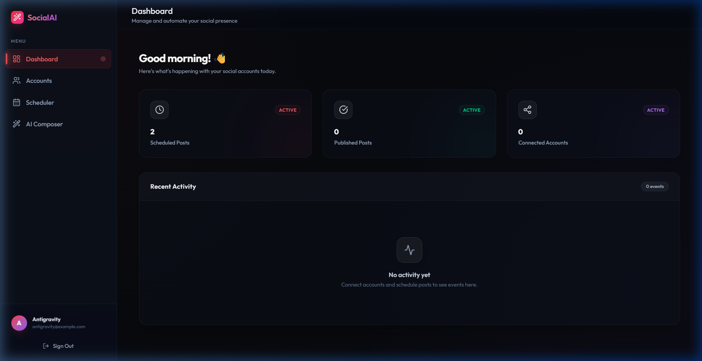
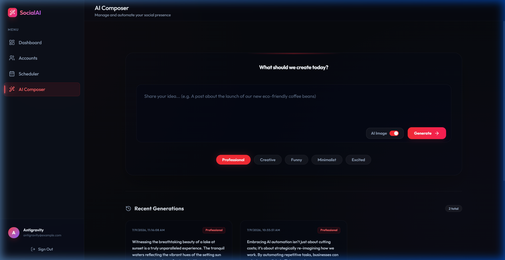
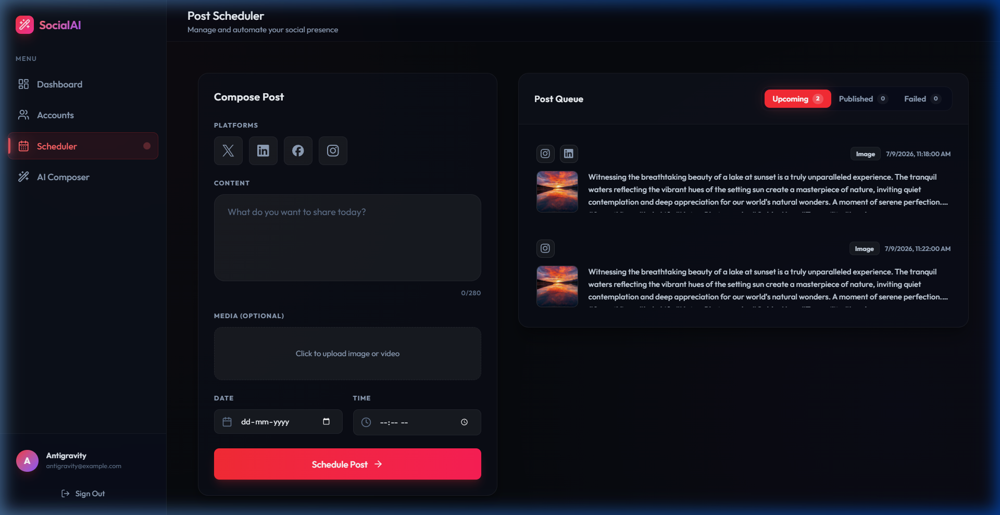
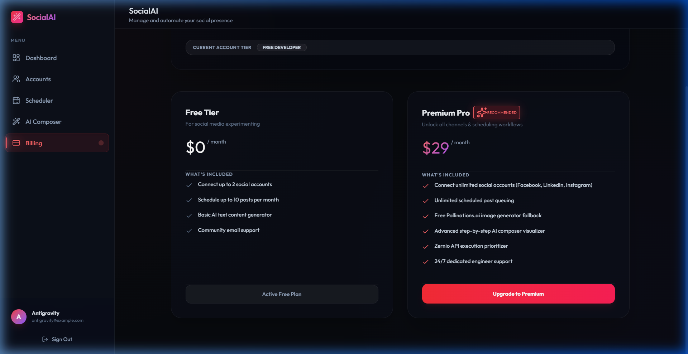

# SocialAI — Social Media Automation & AI Scheduler Dashboard

**SocialAI** is a premium, full-stack social media scheduling and automation dashboard built for developers, agencies, and content creators. It features a fully responsive cosmic dark-themed glassmorphism layout, an interactive AI content composer powered by Google Gemini, automated scheduling, and direct multi-channel publishing.

---

## 🚀 Key Features

*   **Cosmic Glassmorphic UI**: High-fidelity dark theme with vibrant ambient color glows, smooth page transitions, custom sliders, and micro-animations.
*   **AI Content Composer**: Enter a prompt and synthesize complete social media post copy, select post tone (e.g. *Creative, Professional, Funny*), and generate high-resolution image assets with **Pollinations.ai**.
*   **Dynamic Loader States**: Visualized step-by-step progress tracking (*Ideating concept... $\rightarrow$ Drafting copy... $\rightarrow$ Generating artwork...*) during content creation.
*   **Interactive Post Queues**: Clean, space-efficient tabbed queue selector to review **Upcoming**, **Published**, and **Failed** scheduled posts.
*   **Social Accounts Manager**: Connect multiple real social channels (Facebook Pages, LinkedIn Pages, Instagram Business, and X/Twitter profiles) with dedicated custom badges.
*   **Premium Billing Simulation**: Real-time checkout simulation offering pricing tiers, card detail validation, and plan upgrade/downgrade toggle flows.
*   **Fail-Safe Logging**: Background cron publisher that monitors publishing state, retries failures, and records failed posts inside the dashboard activity timeline logs.

---

## 📸 Application Showcase

### Cosmic Dark Dashboard


### AI Content Composer


### Post Scheduling Queue


### Premium Billing Plans


---

## 🛠️ Technology Stack

*   **Frontend**: React.js (v19), Vite (v8), TailwindCSS, Lucide Icons, React Hot Toast, Axios.
*   **Backend**: Node.js, Express.js (v5), Nodemon, Node-Cron, TSX.
*   **Database**: MongoDB Atlas, Mongoose.
*   **AI Integration**: Google Gemini API, Pollinations.ai.
*   **Social Media API Engine**: Zernio.

---

## 📦 Local Installation & Setup

### 1. Prerequisites
Ensure you have **Node.js** (v18+) and **npm** installed on your system.

### 2. Clone and Configure
1. Clone this repository to your local folder.
2. In the `server` directory, create a `.env` file based on `.env.example`:
   ```bash
   cp server/.env.example server/.env
   ```
   Fill in your API credentials (MongoDB Connection URI, JWT Secret, Zernio API Key, Gemini API Key, and Cloudinary keys).
3. In the `client` directory, create a `.env` file based on `.env.example`:
   ```bash
   cp client/.env.example client/.env
   ```

### 3. Install Dependencies & Launch
1. **Start Backend Server**:
   ```bash
   cd server
   npm install
   npm run server
   ```
   *The server will start on [http://localhost:3000](http://localhost:3000)*.

2. **Start Frontend Web App**:
   ```bash
   cd ../client
   npm install
   npm run dev
   ```
   *The client dev server will launch on [http://localhost:5175/](http://localhost:5175/)*.

---

## 🌐 AWS EC2 Production Deployment

This project includes a fully automated deployment script for **AWS EC2** (Ubuntu LTS instances) which sets up Nginx as a reverse proxy, installs Node.js v20 & PM2, compiles client/server code, and runs the application under a production process manager.

### Automated EC2 Setup Instructions:
1. **Launch EC2 Instance**: Launch an Ubuntu 24.04 LTS instance (`t2.micro` or `t3.micro` are AWS Free Tier eligible). In Security Groups, allow ports **22 (SSH)**, **80 (HTTP)**, and **443 (HTTPS)**.
2. **SSH into the Instance** and clone your repository.
3. **Run Deployment Script**:
   ```bash
   chmod +x scripts/deploy-ec2.sh
   sudo ./scripts/deploy-ec2.sh
   ```
4. **Follow Prompts**: Input your Public IP (or Domain) and choose whether to configure SSL.
5. **Add Environment Variables**:
   ```bash
   nano server/.env
   ```
   *Fill in your MongoDB URI, Gemini API key, and other variables, then save.*
6. **Restart Backend**:
   ```bash
   pm2 restart social-scheduler-backend
   ```

---

## 🔒 Security Information
**IMPORTANT**: Never commit `.env` configuration files to public repositories. All sensitive files (`.env`, `node_modules`, build artifacts) are ignored via `.gitignore` to prevent secret leaks and keep credentials secure.

---

## 🤝 Contributing
Contributions, issues, and feature requests are welcome. Feel free to open a pull request or submit issues on the project repository.
